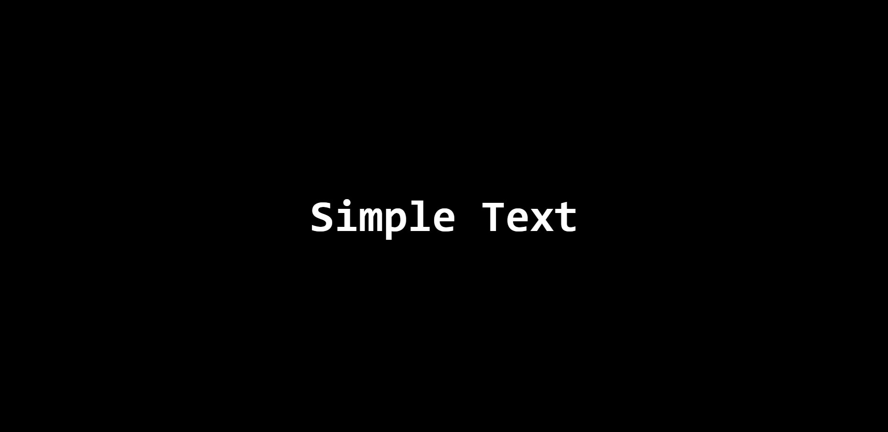
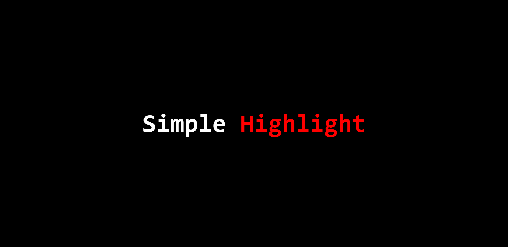
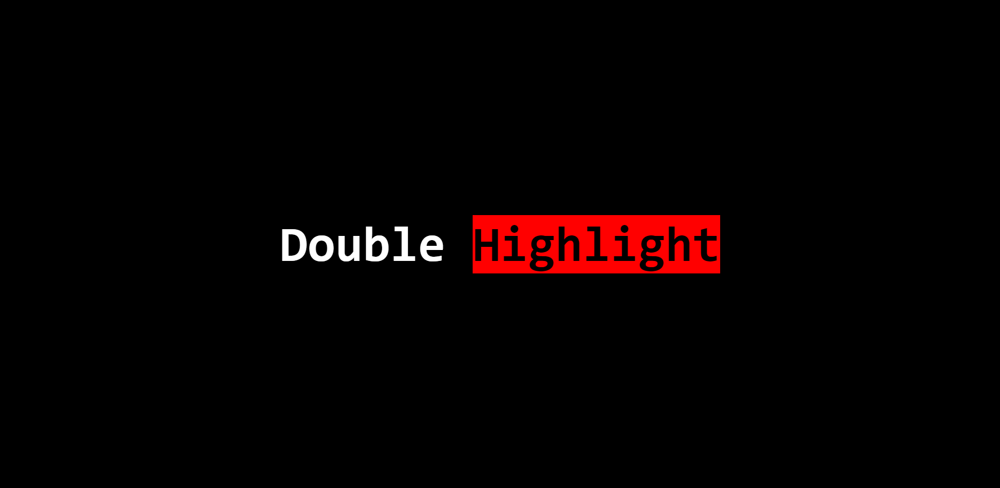

# Text-Loader
**A simple CLI-Interface that allows you to pop-up a Browser window with the text you wrote**

### Installation

##### NPM:
``npm install --global @giancarl021/text-loader``

#### Yarn:
``yarn global add @giancarl021/text-loader``

### Examples

#### Simple text

``text-loader -t "Simple Text"``

This will pop-up a window on your browser with text below:

#### Simple Highlight

``text-loader -t "Simple {Highlight}"``

This will pop-up a window on your browser with the text below:

#### Double Highlight

``text-loader -t "Double {{Highlight}}"`` 

This will pop-up a window on your browser with the text below:

### Flags

``-t|--text`` The text that will be loaded in the page. Default went to ``No text defined``

``-e|--editable`` If the text will be editable on the web page

### Customize Web Page

If you want to customize the CSS or JavaScript of the page, you can by writing ``text-loader config``. This will open the folder where the page is loaded.
